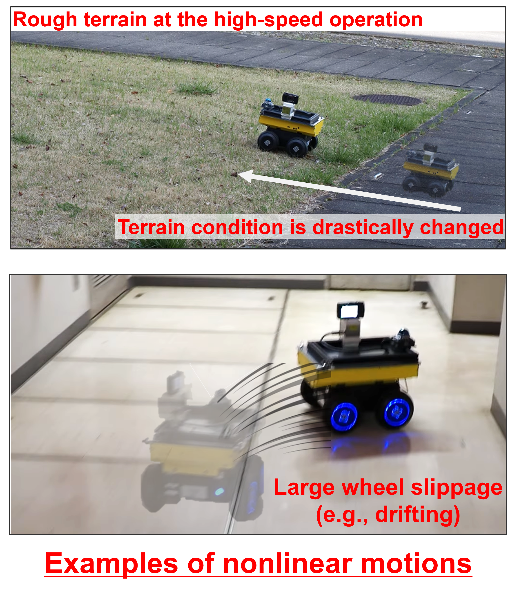

Example: Incorporating the **full linear wheel odometry factor** into LiDAR-IMU odometry to deal with kinematic parameter errors and severely featureless environments.


# Introduction
The full linear wheel odometry factor is a constraint depending on not only robot poses but also the kinematic parameters of a skid-steering robot.
This factor can be used for two- and six-wheeled robots and tracked robots other than four-wheeled robots if these robots don't have steering mechanisms.
The kinematic parameters are defined by the full linear model (Please see the following image for understanding this model). 

Therefore, this factor performs online calibration of kinematic models for skid-steering robots in addition to the motion constraint.
**Owing to the online calibration, reliable wheel odometry-based constraint being adaptive to unknown environments (especially, slippage depending on the type of ground surface) is enabled without prior offline calibration manually**.

The main contribution of this factor is two-fold.
* Online calibration of kinematic parameters for skid-steering robots
    * Skid-steering robot's wheel odometry depends on directly-nonobservable phenomena or values (e.g., wheel slippage, and kinematic model errors caused by tire pressure and  aging).
    * This factor can calibrate the above parameters online.
* Reliable motion constraints
    * Wheel odometry is accurately calculated based on the online calibration.
    * This factor makes an odometry estimation (e.g., LiDAR-IMU odometry) more robust to environments where point clouds degenerate (e.g., long corridors and tunnels).

The following video validates that LiDAR-IMU odometry with our full linear wheel odometry factor accomplishes accurate odometry estimation even in long corridors.
[[video](https://youtu.be/Vss86xUhU80)]

## Overview of the full linear model


# Prerequisited
* [GTSAM](https://github.com/borglab/gtsam/tree/4.2a9)

We tested this code by Ubuntu 22.04

# Usage
**The full linear wheel odometry factor is implemented as a header-only file written in C++. Therefore, you can use this factor by only including this header file in your code.** Please refer to the [examples](https://github.com/TakuOkawara/full_linear_wheel_odometry_factor/tree/main/examples) directory for how to incorporate this factor into your factor graph defined by GTSAM. Specifically, the example file can be executed based on the following commands.
```commandline
cd examples/
cmake .
make
./full_linear_wheel_odometry_factor_example
```

# Cite
Please cite the following paper when you use this code for academic work.

URL: https://ieeexplore.ieee.org/document/10681089?source=authoralert

---

   @article{okawara2024tightly,
     title={Tightly-Coupled LiDAR-IMU-Wheel Odometry with Online Calibration of a Kinematic Model for Skid-Steering Robots},
     author={Okawara, Taku and Koide, Kenji and Oishi, Shuji and Yokozuka, Masashi and Banno, Atsuhiko and Uno, Kentaro and Yoshida, Kazuya},
     journal={IEEE Access},
     volume={12},
     pages={134728--134738},
     year={2024}
     }
  
---
<!-- # Citation
If you use the full linear wheel odometry factor for academic work, please cite the following publication.  -->

# How to extend this work such as for high-speed robot operation
This work can take into account unknown terrain-dependent phenomena (e.g., wheel slippage); however, **large wheel slippage (i.e., nonlinear terms for the kinematic model) is difficult to express accurately for the full linear model**.
To consider this difficulty, we published the following paper:

**Tightly-Coupled LiDAR-IMU-Wheel Odometry with an Online Neural Kinematic Model Learning via Factor Graph Optimization**  
Taku Okawara, Kenji Koide, Shuji Oishi, Masashi Yokozuka, Atsuhiko Banno, Kentaro Uno, and Kazuya Yoshida  
*Robotics and Autonomous Systems*, Jan., 2025 (in press)


📺 [**Full Video on YouTube**](https://www.youtube.com/watch?v=CvRVhdda7Cw)

[](https://www.youtube.com/watch?v=CvRVhdda7Cw)


